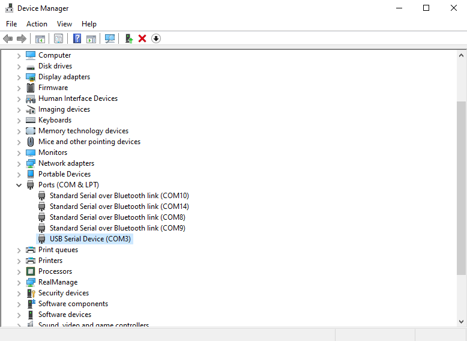

# 98-341 Build Your Own Breadboard Computer - Debugger

This repository contains the scripts necessary to use the W65C02 debugger for 98-341.
Clone this to a convenient place, as it will be necessary for doing nearly anything with the computer.

## 1. Running the Debugger

In order to deploy your code to the computer and view it while it's running,
you will need to use the debugging board.

### 1.1 Finding the Debugger Port

The debugger is identified by a port, which is assigned when you plug it into your laptop.
On Windows you can find the port by looking in Device Manager. It will be under serial devices,
and have a name like COM11 or COM5.
If you're not sure which one it is, try unplugging the board and see which name disappears.



On Linux/MacOS, running the following command will list available devices:
```bash
$ ls /dev/tty*
```
Again, try unplugging and replugging in the board to see which entry in the list appears.

Note that the port for the board may change after unplugging it,
so you will probably have to do this step each time you begin.

### 1.2 Starting a Debugging Session

Once you know the port for your debugger, just run `debugger.py` to start debugging.

```bash
$ python3 ./console/debugger.py --port=path/to/port/goes/here
```

The commands that can be used for the debugger are in section 3.

## 2. Deploying Code

Eventually, you will want to be able to flash assembly programs to your EEPROM.

### 2.1 DASM

In order to turn a program into a binary file (some series of bytes),
you will need an _assembler_.

For this class we will use **DASM**, because it's relatively simple and has some nice features.
You can download DASM from [the DASM homepage](https://dasm-assembler.github.io).
Extract the folder and then place the executable in a convenient location,
as you will need to use it later.
Make sure that it works by running it and checking if it spits out a version or help message:

```bash
$ ./path/to/dasm

DASM 2.20.15-SNAPSHOT
Copyright (c) 1988-2020 by the DASM team.
License GPLv2+: GNU GPL version 2 or later (see file LICENSE).
DASM is free software: you are free to change and redistribute it.
There is ABSOLUTELY NO WARRANTY, to the extent permitted by law.
...      lots of other text ...
```

Note that if you'd like to use some of the extra opcodes added by the W65C02,
you will have to build DASM from source instead. This is completely optional,
but some of the new instructions can be useful.

### 2.2 Building and Deploying

To deploy your code to the EEPROM, first make sure that your debugger is plugged in.
Then use the `deploy.py` script as follows:

```bash
$ python3 ./console/deploy.py --port=path/to/debugger/port --dasm=path/to/dasm/executable path/to/code.S
```

This will use DASM to compile your program, and then flash the resulting binary to the EEPROM.
The compiled program will be stored as three files in the root directory:
- `asm.bin`, which contains the raw compiled binary (with a header to indicate some metadata),
- `asm.lst`, which contains the mapping from source instructions to addresses in the binary, and
- `asm.sym`, which contains the addresses of all the labels in your program.

The debugger can parse these files to show you the instructions as they are written in your program,
similar to gdb's source view. To do this, simply pass them in when starting the debugger:

```bash
$ python3 ./console/debugger.py --port=path/to/debugger/port asm.lst asm.sym
```

## 3. Debugger Commands and Usage

There are several commands, inspired by GDB's interface.

| Short | Long | Description |
| ----- | ---- | ----------- |
|  `r`  | `reset`     | Asserts the reset signal so that the processor start resetting next cycle. |
|  `s`  | `step`      | Advances until the next instruction, i.e. when SYNC and PHI2 are both high. |
|  `y`  | `stepcycle` | Advances until the next cycle, i.e. when PHI2 is high. |
|  `h`  | `stephalf`  | Advances to the next half cycle, i.e. if PHI2 is high it will go low and vice versa. |
|  `c`  | `continue`  | Continues the processor at full speed. Use Ctrl-C to pause the program again. |
|  `w`  | `walk`      | Continues the processor at slow speed. Use Ctrl-C to pause the program again. |
|  `b`  | `break`     | Sets a breakpoint at a given source location. See below for usage. |
|  `q`  | `quit`      | Exits the debugger. |

### 3.2 Breakpoints

Breakpoints can be set in three ways.

A breakpoint set at a raw address will stop whenever that address is accessed in any way.
```
b $8123
```

When debug info is provided, a breakpoint can be set at a label,
which will stop when the instruction afterwards is fetched.
```
b foo_bar
```

When debug info is provided, a breakpoint can be set at a source line,
which will stop when the instruction at that line is fetched.
```
b 123
```